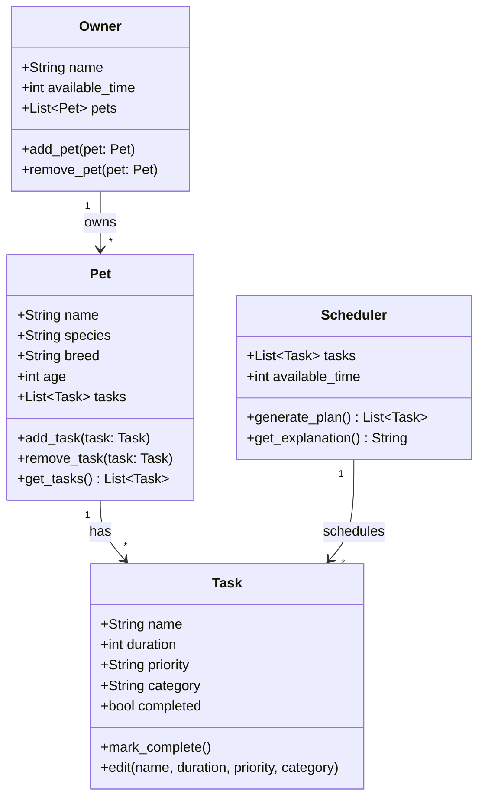

# PawPal+ UML Class Diagram

```mermaid
classDiagram
    class Owner {
        +String name
        +int available_time
        +List~Pet~ pets
        +add_pet(pet: Pet)
        +remove_pet(pet: Pet)
    }

    class Pet {
        +String name
        +String species
        +String breed
        +int age
        +List~Task~ tasks
        +add_task(task: Task)
        +remove_task(task: Task)
        +get_tasks() List~Task~
    }

    class Task {
        +String name
        +int duration
        +String priority
        +String category
        +bool completed
        +mark_complete()
        +edit(name, duration, priority, category)
    }

    class Scheduler {
        +List~Task~ tasks
        +int available_time
        +generate_plan() List~Task~
        +get_explanation() String
    }

    Owner "1" --> "*" Pet : owns
    Pet "1" --> "*" Task : has
    Scheduler "1" --> "*" Task : schedules
```
